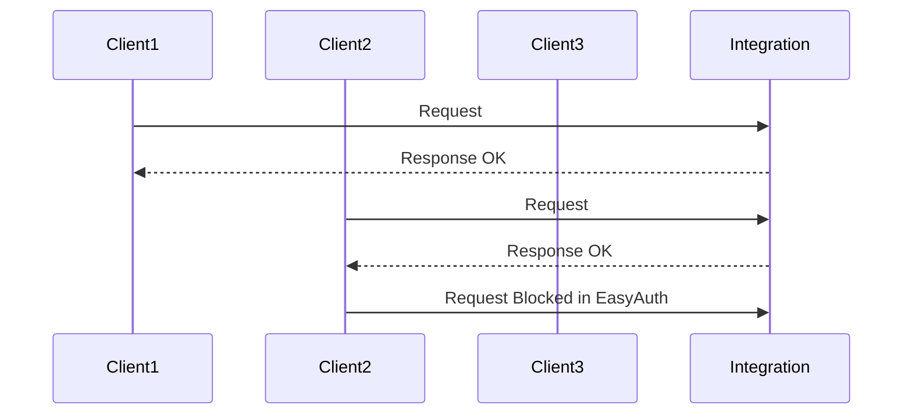

# Logic Apps and EasyAuth

Reference: [Trigger workflows in Standard logic apps with Easy Auth](https://techcommunity.microsoft.com/t5/azure-integration-services-blog/trigger-workflows-in-standard-logic-apps-with-easy-auth/ba-p/3207378)

Key points:
- Add `authsettingsV2` to define the EasyAuth configuration
- Add `logicAppsAccessControlConfiguration` to block SAS authentication on triggers
- Portal features e.g., workflow designer, are working as expected

See `main.bicep` for the complete configuration and `setup.ps1` for the demo setup:



```
GET https://<workflow>.azurewebsites.net:443/api/workflow1/triggers/request/invoke?api-version=2022-05-01&sp=%2Ftriggers%2Frequest%2Frun&sv=1.0&sig=Qs...hAB8o
Authorization: Bearer <token>
```

```json
{
  "error": {
    "code": "DirectApiRequestHasMoreThanOneAuthorization",
    "message": "The request has SAS authentication scheme, 'Bearer' authorization scheme or internal token scheme. Only one scheme should be used."
  }
}
```

```
GET https://<workflow>.azurewebsites.net:443/api/workflow1/triggers/request/invoke?api-version=2022-05-01&sp=%2Ftriggers%2Frequest%2Frun&sv=1.0&sig=Qs...hAB8o
```

```json
{
  "error": {
    "code": "DirectApiInvalidAuthorizationScheme",
    "message": "The request has SAS authentication scheme while it is disabled under your access control policy."
  }
}
```
